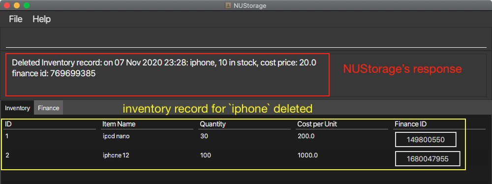
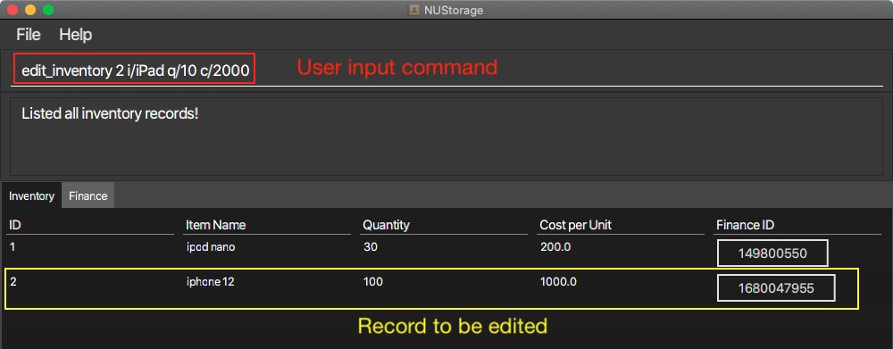
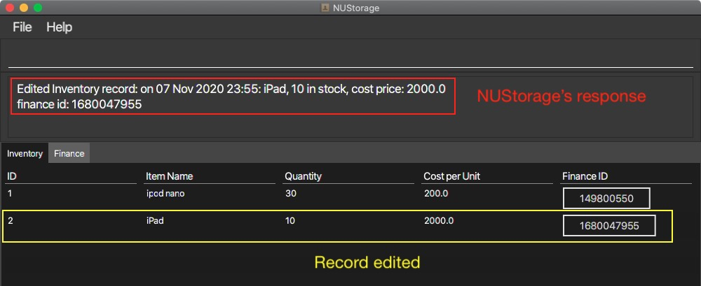
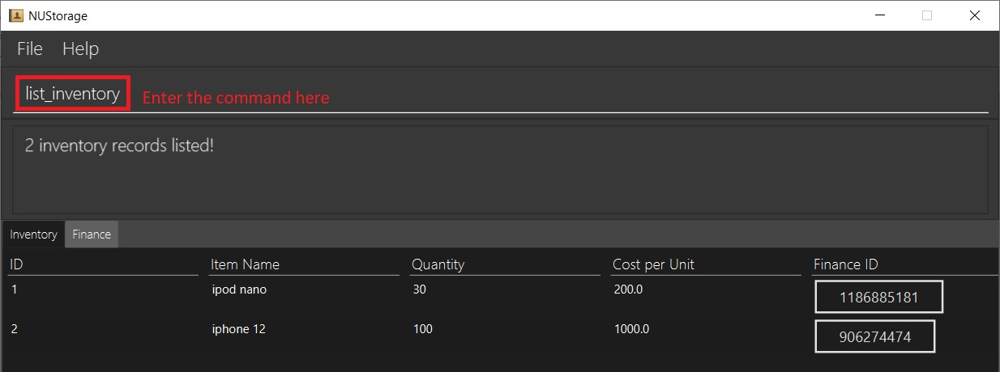
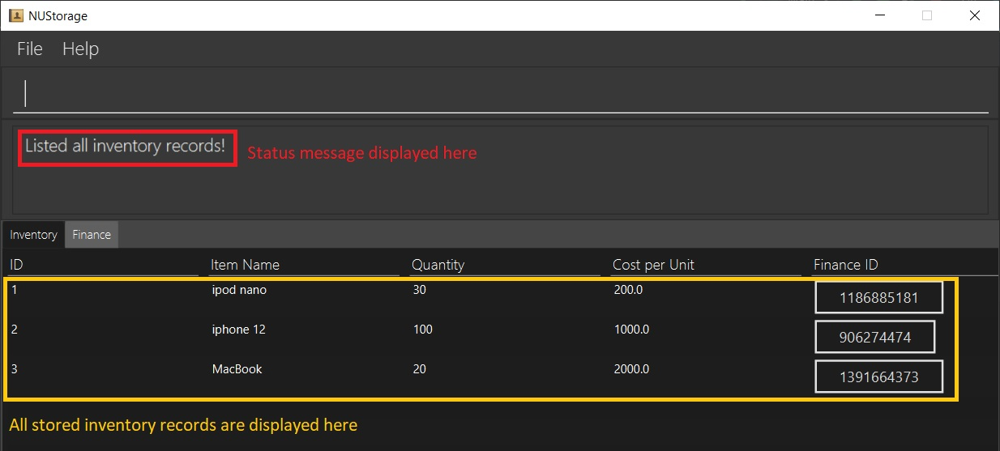
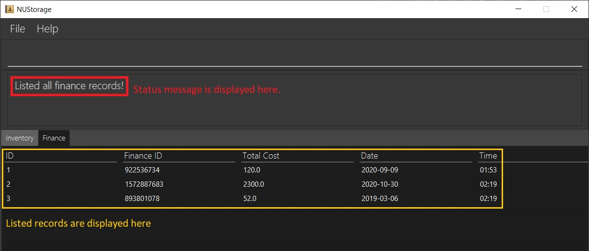

* Table of Contents
{:toc}

---

## 1. Introduction

NUStorage is a desktop application for __managing inventory, finance transactions and accounts__.

NUStorage is optimised for store owners and managers who prefer to work with a command line interface (CLI) while still enjoying the visual benefits of a graphical user interface (GUI).

With some experience in typing, NUStorage can manage your inventory and finance records much faster than traditional GUI-based applications, streamlining your workflow and increasing productivity.

Interested? Read on to get started!

---

## 2. Quick start

1. Ensure that you have `Java 11` or above installed on your device.
2. Download the latest release of `NUStorage.jar` [here](https://github.com/AY2021S1-CS2103T-T11-3/tp/releases).
3. Copy the `.jar` file to the folder you want to use as the home folder for your application.
4. Double-click on the `.jar` file to start the app. The GUI should look something like this:
5. 
    

6. Type a command in the command box and press enter to execute.
    * Here are some sample commands you can try to get started with:
        * `list_inventory` to list inventory records
        * `list_finance` to list finance records
        * `add_inventory i/Logitech G400 q/20 c/69` to add 20 Logitech G400 gaming mouse that cost $69 to the inventory
        * `add_finance amt/120.17` to add an inbound transaction of $120.17
        * `bye` to exit programme
    * Refer to the commands list below for details of each command.

---

## 3. Features

**:information_source: Notes about the command format:** 

* Words in `UPPER_CASE` are the __parameters__ to be supplied by the user. 
    e.g. in `add_inventory i/[ITEM]`, `ITEM` is a parameter which can be used as `add_inventory i/MacBook`.
* Items in square brackets are optional. 
  e.g `amt/AMOUNT at/[DATE] [TIME]` can be used as the possible formats:
  * `amt/200 at/2020-04-10 18:00`
  * `amt/200 at/2020-04-10`
  * `amt/200 at/18:00`
  * `amt/200 at/2020-04-10`
  * `amt/200`

---

## 4. Commands

This section shows the commands that can be used with NUStorage. It is divided into three sections:

1. Inventory commands
2. Finance account commands
3. Universal commands

Accompanying the details of each command are figures that show an example of the command and the result of executing the command.

---

### 4.1. Inventory commands

---

#### 4.1.1. Add items to inventory: `add_inventory`

Adds and stores a new inventory record into the inventory list.

Format: `add_inventory i/[ITEM_NAME] q/[QUANTITY] c/[ITEM_COST]`

Example: `add_inventory i/iphone q/10`

Result: item `iphone` of quantity `10` is added to the inventory.

---

#### 4.1.2. Remove items from inventory: `delete_inventory`

Removes the specified record from the inventory list.

Format: `delete_inventory [INDEX]`

Example: `delete_inventory 1`

Result: record at index `1` is removed from the inventory list of records.

---

#### 4.1.3. Edit record in inventory: `edit_inventory`

Edits the specified record in the inventory list.

Format: `edit_inventory [INDEX] i/[ITEM_NAME] q/[QUANTITY]`

Example: `edit_inventory 1 i/iPad q/100`

Result: item name changed from `iphone` to `iPad` and its quantity changed from `10` to `100`.

---

#### 4.1.4. List inventory records: `list_inventory`

Displays all records in the inventory list.

Format: `list_inventory`

Example: `list_inventory`

Result: inventory is listed.

---

### 4.2. Finance commands

---

#### 4.2.1. Add finance records: `add_finance`

Adds and stores a new finance record into the account.

Note: Date and time are default to current location's datetime unless specified

Format: `add_finance amt/[AMOUNT] at/[DATE] [TIME]`

Example: `add_finance amt/30000 at/2020-03-03`

Result: finance record of amount `$30000` on `3rd March 2020` is added to the the finance account.

---

#### 4.2.2. Delete finance records: `delete_finance`

Deletes the specified finance record from the account.

Format: `delete_finance [INDEX]`

Example: `delete_finance 1`

Result: record at index `1` is removed from the finance account records.

---

#### 4.2.3. Edit record in finance: `edit_finance`

Edits the specified record in the finance account.

Format: `edit_finance [INDEX] amt/[AMOUNT] at/[DATE]`

Example: `edit_finance 1 amt/120 at/2020-10-01`

Result: record changed to amount `$120` on `1st Oct 2020`.

---

#### 4.2.4. List finance records: `list_finance`

Displays all the finance records in the account.

Format: `list_finance`

Example: `list_finance`

Result: finance account is listed.

---

### 4.3. Universal commands

---

#### 4.3.1. Quit the programme: `exit`

Saves data locally in a data file and exits the programme.

Format: `exit`

Example: `exit`

Result: Programme terminates.

---

#### 4.3.2. Undo/Redo the previous command: `undo`/`redo`[coming in v2.0]`

Undo or redo the previous command

Format: `undo` or `redo`

Example: `undo` or `redo`

Result: Undo or redo the previous command.

---

## 5. Command summary

Action | Format, Examples
--------|------------------
__Add inventory__ | `add_inventory i/[ITEM] q/[QUANTITY] c/[ITEM_COST]`   e.g. `add_inventory i/MacBook pro q/200 c/50`
__Delete inventory__ | `delete_inventory [INDEX]`   e.g. `delete_inventory 4`
__Edit inventory__ | `edit_inventory [INDEX] i/[ITEM_NAME] q/[QUANTITY]`  e.g. `edit_inventory 3 i/Lenovo Y50 q/10`
__List inventory__ | `list_inventory`
__Add finance__ | `add_finance amt/[AMOUNT] at/[DATE] [TIME]`   e.g. `add_finance amt/420.69 at/2020-04-23`
__Delete finance__ | `delete_finance [INDEX]`   e.g. `delete_finance 2`
__Edit finance__ | `edit_finance [INDEX] amt/[AMOUNT] at/[DATE] [TIME]`   e.g. `edit_finance 1 amt/120 at/2020-10-01`
__List finance__ | `list_finance`
__Exit programme__ | `exit`

---

## 6. FAQs

### 6.1. How do I migrate the data to another computer?

WARNING: doing so will overwrite the existing data you may have on the other device. Please make sure you make a backup before migrating data.

Steps to migrate data:

1. Locate the data files under the directory (folder) `./data`. The data files are names `inventory.json` and `financeAccount.json` respectively.
2. Copy the files to the other device.
3. Place the two files under the directory `./data`.
4. Restart NUStorage on the other device to load the data.

### 6.2. How do I combine data from two devices?

Currently, NUStorage does not support the merging of data between different devices. NUStorage only supports moving of data from one device to another. Please see FAQ 5.2 regarding how to migrate data.

### 6.3. Can I directly modify the storage file?

Modifying the storage file is possible but NOT RECOMMENDED! Doing so may result in a complete data loss.

---

